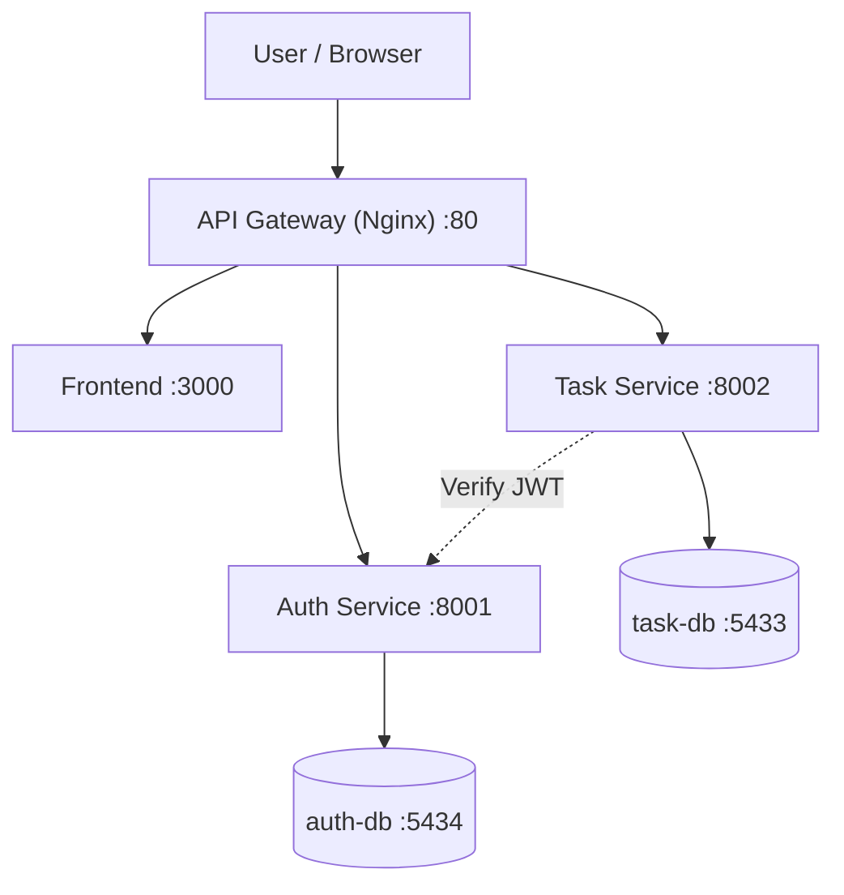
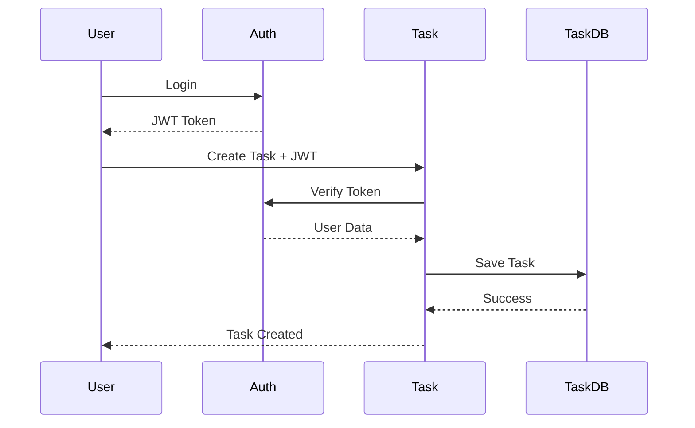

# Microservices Architecture Documentation - SowelTask


# 1. Architecture Diagram



---

# 2. Services and Ports

| Service      | Port | Description                   |
| ------------ | ---- | ----------------------------- |
| gateway      | 80   | Reverse Proxy dan API Gateway |
| frontend     | 3000 | Frontend SowelTask            |
| auth-service | 8001 | Authentication Service        |
| task-service | 8002 | Task Management Service       |
| auth-db      | 5434 | Database pengguna             |
| task-db      | 5433 | Database tugas                |

---

# 3. API Contract

Base URL

```text
http://localhost
```

## 3.1 Auth Service

### POST /auth/register

Digunakan untuk registrasi pengguna baru.

Request:

```json
{
  "name": "Andi Pratama",
  "email": "andi@example.com",
  "password": "Cloud@123",
  "phone": "081234567890"
}
```

Response:

```json
{
  "id": 1,
  "name": "Andi Pratama",
  "email": "andi@example.com"
}
```

---

### POST /auth/login

Digunakan untuk login dan menghasilkan JWT Token.

Request:

```json
{
  "email": "andi@example.com",
  "password": "Cloud@123"
}
```

Response:

```json
{
  "access_token": "jwt_token",
  "token_type": "bearer"
}
```

---

### GET /auth/verify

Digunakan untuk memvalidasi JWT Token.

Header:

```text
Authorization: Bearer TOKEN
```

Response:

```json
{
  "user_id": 1,
  "email": "andi@example.com",
  "name": "Andi Pratama"
}
```

---

## 3.2 Task Service

### POST /tasks

Digunakan untuk membuat tugas baru.

Header:

```text
Authorization: Bearer TOKEN
```

Request:

```json
{
  "title": "Menyelesaikan Dokumentasi Microservices",
  "description": "Membuat file architecture.md untuk Week 12",
  "status": "pending",
  "due_date": "2026-06-10"
}
```

Response:

```json
{
  "id": 1,
  "user_id": 1,
  "title": "Menyelesaikan Dokumentasi Microservices",
  "status": "pending"
}
```

---

### GET /tasks

Digunakan untuk menampilkan seluruh tugas milik pengguna.

Header:

```text
Authorization: Bearer TOKEN
```

Response:

```json
[
  {
    "id": 1,
    "title": "Menyelesaikan Dokumentasi Microservices",
    "status": "pending",
    "due_date": "2026-06-10"
  }
]
```

---

### GET /tasks/{id}

Digunakan untuk menampilkan detail tugas berdasarkan ID.

Header:

```text
Authorization: Bearer TOKEN
```

Response:

```json
{
  "id": 1,
  "user_id": 1,
  "title": "Menyelesaikan Dokumentasi Microservices",
  "description": "Membuat file architecture.md untuk Week 12",
  "status": "pending",
  "due_date": "2026-06-10",
  "created_at": "2026-06-01T10:00:00Z"
}
```

---

### PUT /tasks/{id}

Digunakan untuk memperbarui data tugas.

Header:

```text
Authorization: Bearer TOKEN
```

Request:

```json
{
  "title": "Menyelesaikan Dokumentasi dan Testing",
  "status": "in_progress"
}
```

Response:

```json
{
  "message": "Task berhasil diperbarui"
}
```

---

### DELETE /tasks/{id}

Digunakan untuk menghapus tugas.

Header:

```text
Authorization: Bearer TOKEN
```

Response:

```json
{
  "message": "Task berhasil dihapus"
}
```

---

# 4. Running Locally

Menjalankan seluruh service:

```bash
docker compose up --build -d
```

Melihat container yang berjalan:

```bash
docker compose ps
```

Melihat seluruh log service:

```bash
docker compose logs -f
```

Menghentikan seluruh service:

```bash
docker compose down
```

---

# 5. Service Communication

Alur komunikasi antar service:

1. User melakukan login melalui Auth Service.
2. Auth Service menghasilkan JWT Token.
3. User mengirim request ke Task Service dengan JWT Token.
4. Task Service meminta validasi token ke Auth Service.
5. Auth Service mengembalikan data pengguna.
6. Task Service memproses request.
7. Data tugas disimpan ke task-db.

Diagram komunikasi:



---

# 6. Debugging

## Auth Service

Melihat log Auth Service:

```bash
docker compose logs auth-service
```

Masuk ke container Auth Service:

```bash
docker compose exec auth-service sh
```

---

## Task Service

Melihat log Task Service:

```bash
docker compose logs task-service
```

Masuk ke container Task Service:

```bash
docker compose exec task-service sh
```

---

## Gateway

Melihat log Gateway:

```bash
docker compose logs gateway
```

---

## Database

Melihat seluruh container:

```bash
docker compose ps
```

Melihat log database:

```bash
docker compose logs auth-db
docker compose logs task-db
```

---

# 7. Testing

### Register User

```bash
curl -X POST http://localhost/auth/register \
-H "Content-Type: application/json" \
-d '{
"name":"Andi Pratama",
"email":"andi@example.com",
"password":"Cloud@123",
"phone":"081234567890"
}'
```

### Login User

```bash
curl -X POST http://localhost/auth/login \
-H "Content-Type: application/json" \
-d '{
"email":"andi@example.com",
"password":"Cloud@123"
}'
```

### Membuat Task

```bash
curl -X POST http://localhost/tasks \
-H "Authorization: Bearer TOKEN" \
-H "Content-Type: application/json" \
-d '{
"title":"Menyelesaikan Dokumentasi Microservices",
"description":"Membuat file architecture.md",
"status":"pending",
"due_date":"2026-06-10"
}'
```

### Menampilkan Daftar Task

```bash
curl http://localhost/tasks \
-H "Authorization: Bearer TOKEN"
```

---

# 8. Conclusion

Implementasi arsitektur microservices pada aplikasi SowelTask berhasil dilakukan dengan memisahkan layanan autentikasi dan layanan manajemen tugas ke dalam service yang independen. Setiap service memiliki database masing-masing sehingga mendukung prinsip loose coupling dan memudahkan pengembangan serta pemeliharaan sistem. API Gateway berfungsi sebagai pintu masuk utama aplikasi dan meneruskan request ke service yang sesuai. Berdasarkan hasil pengujian, proses registrasi, login, validasi JWT, pembuatan tugas, pengelolaan tugas, dan komunikasi antar service berjalan dengan baik. Pendekatan microservices yang diterapkan pada SowelTask memberikan fleksibilitas yang lebih tinggi dalam pengembangan dan skalabilitas aplikasi di masa mendatang.
