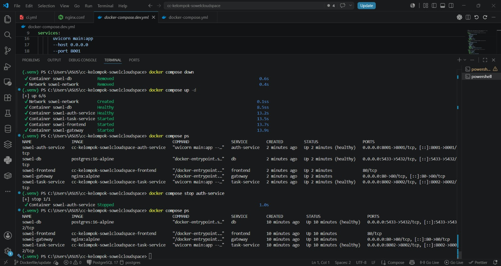
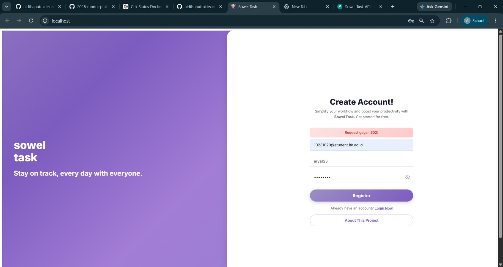
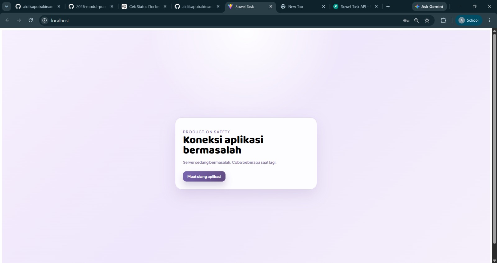
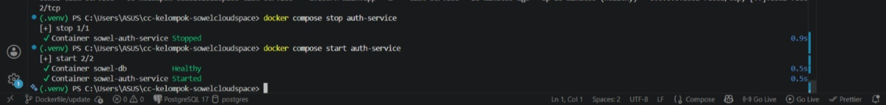
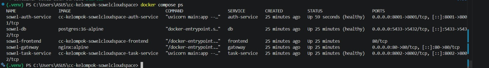

# Reliability Testing

Dokumen ini menyajikan hasil pengujian reliabilitas sistem untuk memastikan aplikasi tetap berfungsi secara stabil ketika menghadapi gangguan layanan (*service down*), kegagalan komunikasi (*timeout/unavailable service*), serta proses pemulihan layanan (*service recovery*).

---

# Test Environment

## Components

* Frontend (React)
* Auth Service (FastAPI)
* Task Service (FastAPI)
* Database (PostgreSQL)
* Gateway (Nginx)
* Docker Compose

## Verification Command

```bash
docker compose ps
```

## Initial Service Status

| Service      | Status       |
| ------------ | ------------ |
| auth-service | Up (healthy) |
| task-service | Up (healthy) |
| db           | Up (healthy) |
| gateway      | Up           |
| frontend     | Up           |

---

# Test Scenario 1: Service Down

## Objective

Memastikan sistem dapat menangani kondisi ketika Authentication Service tidak tersedia.

## Reproduction Steps

1. Pastikan seluruh service berjalan normal.

```bash
docker compose ps
```

2. Hentikan Authentication Service.

```bash
docker compose stop auth-service
```

3. Verifikasi service telah berhenti.

```bash
docker compose ps
```

4. Buka aplikasi melalui browser.

```text
http://localhost
```

5. Coba fitur yang membutuhkan Authentication Service, seperti:

* Register akun
* Login pengguna
* Akses endpoint health

## Expected Behavior

* Authentication Service tidak dapat diakses.
* Frontend tetap dapat dibuka.
* Gateway tetap berjalan.
* Request yang membutuhkan Authentication Service gagal diproses.
* Service lain tetap berjalan normal.
* Sistem tidak crash.

## Test Result


 

 

Authentication Service berhasil dihentikan menggunakan perintah:

```bash
docker compose stop auth-service
```

Frontend tetap dapat diakses oleh pengguna dan Gateway tetap berjalan normal. Namun ketika pengguna mencoba melakukan registrasi atau mengakses endpoint yang memerlukan Authentication Service, Gateway mengembalikan error HTTP 502 Bad Gateway.

Log Gateway menunjukkan:

```text
connect() failed (113: Host is unreachable)
```

yang menandakan Gateway tidak dapat terhubung ke Authentication Service yang sedang berhenti.

| Expected Behavior                | Actual Result                                   | Status |
| -------------------------------- | ----------------------------------------------- | ------ |
| Auth Service tidak dapat diakses | Auth Service berhasil dihentikan                | ✅      |
| Frontend tetap dapat diakses     | Frontend tetap berjalan normal                  | ✅      |
| Request Authentication gagal     | Gateway mengembalikan HTTP 502                  | ✅      |
| Service lain tetap berjalan      | Task Service, Database, dan Gateway tetap aktif | ✅      |
| Sistem tidak crash               | Tidak terjadi crash                             | ✅      |

---

# Test Scenario 2: Timeout / Unavailable Service Handling

## Objective

Memastikan sistem mampu menangani kegagalan komunikasi ketika service tujuan tidak tersedia tanpa menyebabkan aplikasi berhenti merespons.

## Reproduction Steps

1. Hentikan Authentication Service.

```bash
docker compose stop auth-service
```

2. Buka aplikasi melalui browser.

3. Lakukan request yang memerlukan Authentication Service, seperti:

* Register
* Login
* Health Check

4. Amati respons aplikasi dan log Gateway.

## Expected Behavior

* Request gagal diproses.
* Gateway mengembalikan error yang sesuai.
* Frontend tetap responsif.
* Service lain tetap berjalan.
* Sistem tidak hang.

## Test Result





Ketika Authentication Service tidak tersedia, Gateway mencoba meneruskan request ke service tujuan namun gagal karena host tidak dapat dijangkau.

Log Gateway menunjukkan:

```text
GET /health HTTP/1.1" 502
connect() failed (113: Host is unreachable)
```

dan

```text
POST /auth/register HTTP/1.1" 502
connect() failed (113: Host is unreachable)
```

Frontend tetap dapat digunakan dan tidak mengalami freeze. Hanya request yang bergantung pada Authentication Service yang gagal diproses.

| Expected Behavior               | Actual Result                                   | Status |
| ------------------------------- | ----------------------------------------------- | ------ |
| Request gagal secara terkontrol | Gateway mengembalikan HTTP 502                  | ✅      |
| Sistem menampilkan error        | Error 502 berhasil ditampilkan                  | ✅      |
| Frontend tetap responsif        | Frontend tetap berjalan normal                  | ✅      |
| Service lain tetap berjalan     | Gateway, Database, dan Task Service tetap aktif | ✅      |
| Sistem tidak hang               | Tidak terjadi hang                              | ✅      |

---

# Test Scenario 3: Service Recovery

## Objective

Memastikan sistem dapat kembali beroperasi normal setelah service yang gagal kembali aktif.

## Reproduction Steps

1. Jalankan kembali Authentication Service.

```bash
docker compose start auth-service
```

2. Verifikasi status service.

```bash
docker compose ps
```

3. Pastikan status berubah menjadi:

```text
Up (healthy)
```

4. Ulangi request yang sebelumnya gagal.

5. Verifikasi hasilnya.

## Expected Behavior

* Authentication Service kembali aktif.
* Komunikasi Gateway dan Authentication Service kembali normal.
* Request berhasil diproses.
* Sistem tidak memerlukan restart penuh.

## Test Result







Setelah Authentication Service dijalankan kembali, status service berubah menjadi **Up (healthy)**. Request yang sebelumnya gagal dapat diproses kembali tanpa perlu melakukan restart pada Gateway, Frontend, Database, maupun Task Service.

| Expected Behavior                | Actual Result                       | Status |
| -------------------------------- | ----------------------------------- | ------ |
| Auth Service kembali aktif       | Status berubah menjadi Up (healthy) | ✅      |
| Komunikasi kembali normal        | Request kembali berhasil diproses   | ✅      |
| Sistem tidak perlu restart penuh | Sistem langsung normal              | ✅      |

---

# Test Summary

| No | Scenario                               | Actual Result                                          | Status |
| -- | -------------------------------------- | ------------------------------------------------------ | ------ |
| 1  | Service Down                           | Auth Service berhenti, service lain tetap berjalan     | PASS ✅ |
| 2  | Timeout / Unavailable Service Handling | Gateway mengembalikan HTTP 502 tanpa crash sistem      | PASS ✅ |
| 3  | Service Recovery                       | Auth Service kembali healthy dan sistem normal kembali | PASS ✅ |

---

# Conclusion

Berdasarkan pengujian yang telah dilakukan, sistem mampu menangani kondisi ketika Authentication Service tidak tersedia tanpa menyebabkan kegagalan total aplikasi. Gateway berhasil mengembalikan error yang sesuai, Frontend tetap dapat diakses, dan service lain tetap berjalan normal. Setelah Authentication Service diaktifkan kembali, sistem dapat pulih dan beroperasi normal tanpa memerlukan restart penuh pada seluruh layanan.
