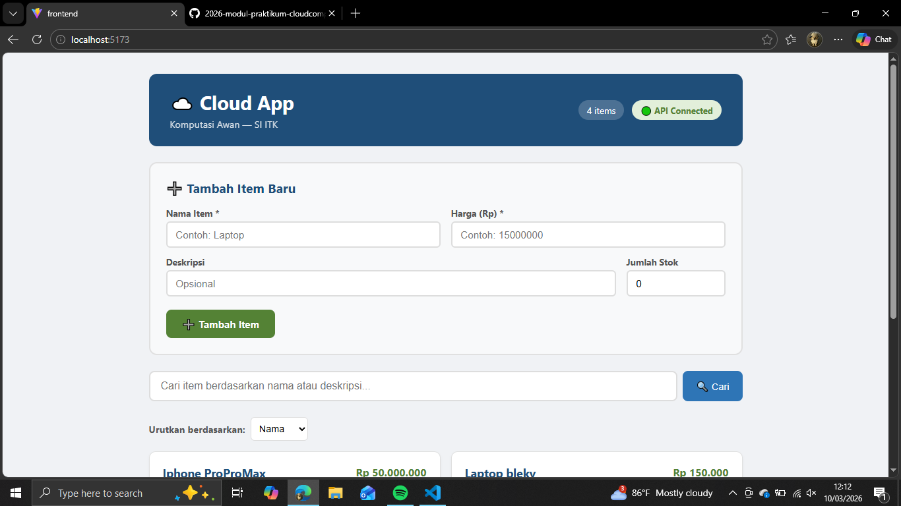
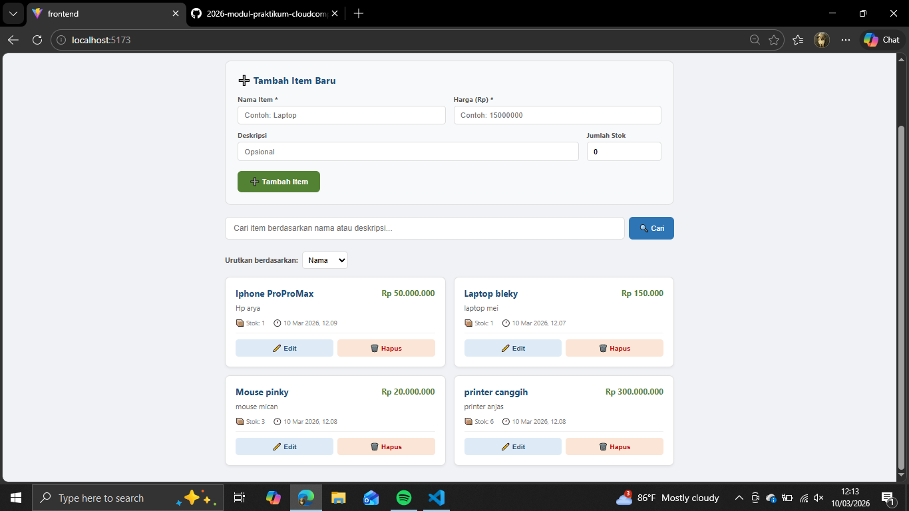
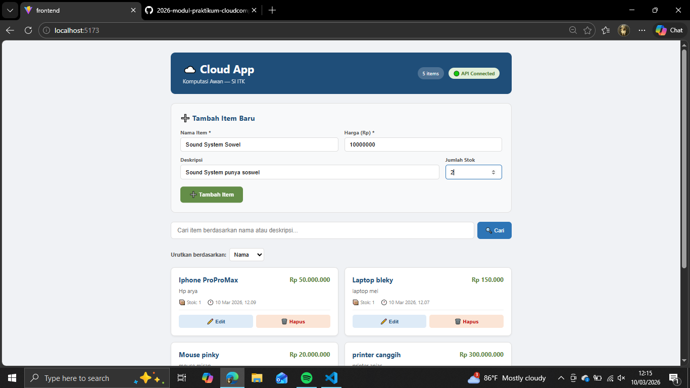
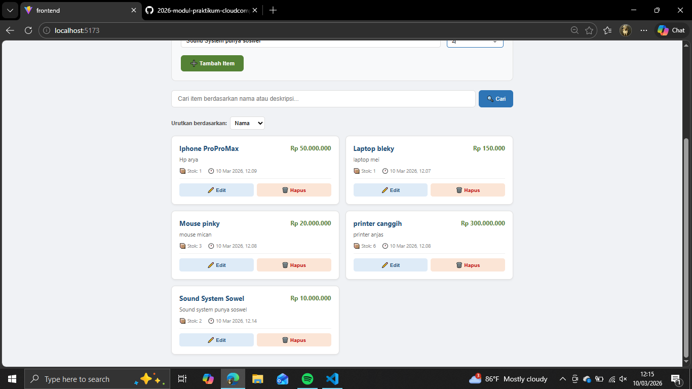
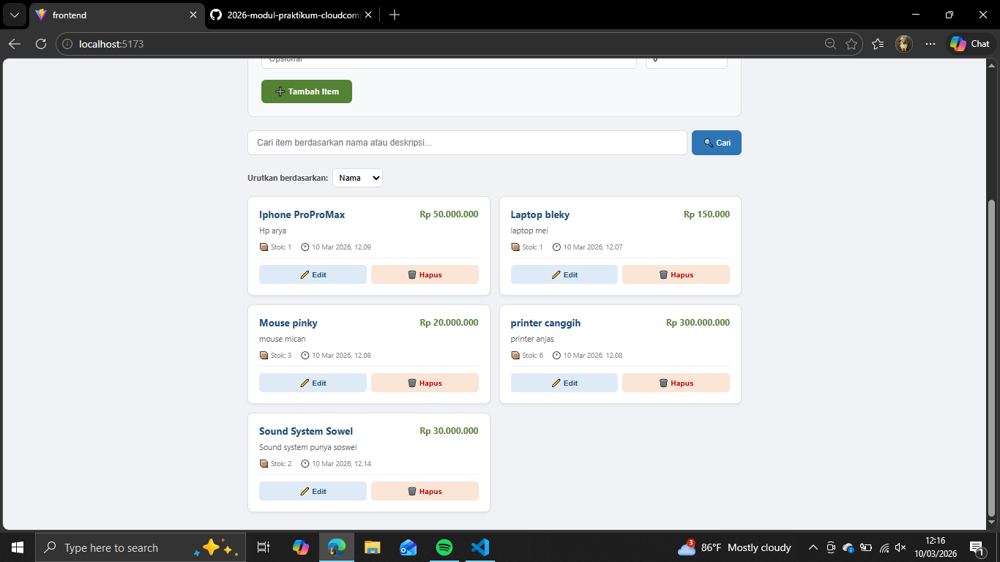
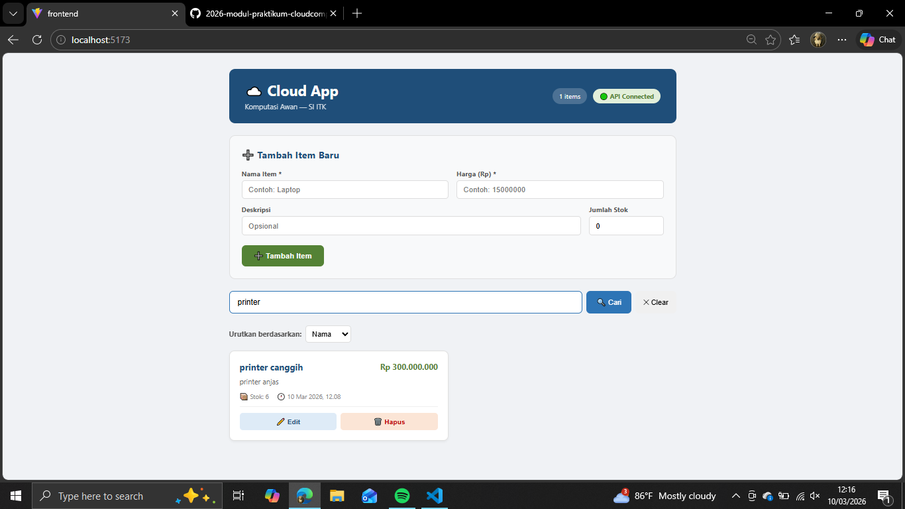
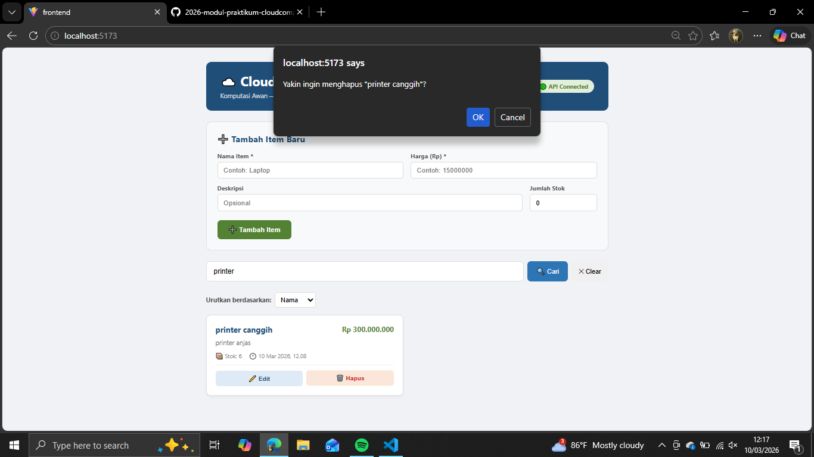
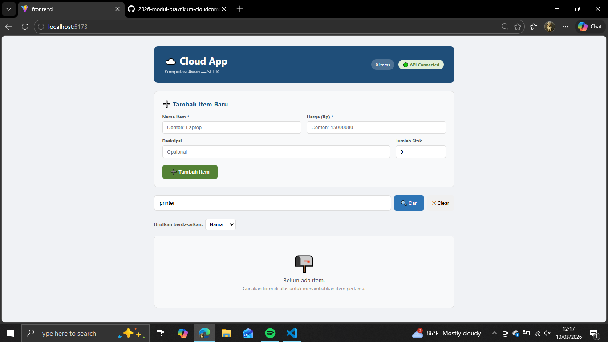
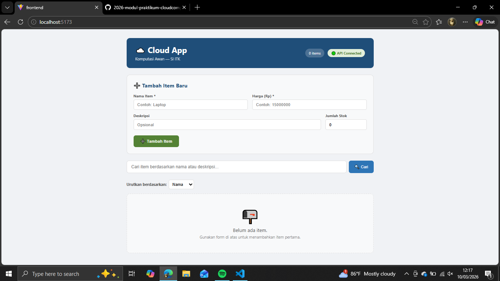

# UI Test Results

### Test Case 1: Cek status API🟢 Connected?
- **Status:** Pass ✅
- **Keterangan:** API berhasil connected.

**Hasil Pengujian**

### Test Case 2: Items dari Modul 2 muncul di daftar?
- **Status:** Pass ✅
- **Keterangan:** Item dari modul 2 berhasil muncul.

**Hasil Pengujian**

### Test Case 3: Tambah item baru via form
- **Status:** Pass ✅
- **Keterangan:** Item berhasil ditambahkan.

**Hasil Pengujian**

### Test Case 4: Item muncul di daftar?
- **Status:** Pass ✅
- **Keterangan:** Item berhasil muncul didalam daftar.

**Hasil Pengujian**

### Test Case 5: Klik Edit pada item
- **Status:** Pass ✅
- **Keterangan:** Button Edit berfungsi.

**Hasil Pengujian**

### Test Case 6: Form terisi data lama? Ubah harga, klik Update
- **Status:** Pass ✅
- **Keterangan:** Data berhasil dipudate. Harga barang berhasil diubah.

**Hasil Pengujian**

### Test Case 7: Cari item via SearchBar
- **Status:** Pass ✅
- **Keterangan:** Data berhasil dicari dengan searchbar.

**Hasil Pengujian**

### Test Case 8: Hapus item,confirm dialog muncul?
- **Status:** Pass ✅
- **Keterangan:** Confirm dialog berhasil muncul saat akan menghapus data.

**Hasil Pengujian**
 

### Test Case 9:  Item hilang dari daftar?
- **Status:** Pass ✅
- **Keterangan:** Item berhasil dihapus dari daftar.

**Hasil Pengujian**
 

### Test Case 10:  Hapus semua → Empty state muncul?
- **Status:** Pass ✅
- **Keterangan:** Empty state berhasil muncul saat daftar item kosong.

**Hasil Pengujian**
 

### KESIMPULAN TEST 
Berdasarkan hasil pengujian yang telah dilakukan terhadap 10 skenario utama, dapat disimpulkan bahwa :

- Stabilitas UI: Seluruh komponen antarmuka (UI) berfungsi dengan baik sesuai dengan spesifikasi desain dan alur pengguna.

- Konektivitas: Integrasi antara frontend dan backend (API) berjalan tanpa hambatan (status Connected).

- Hasil Akhir: Pengujian dinyatakan BERHASIL (100% Pass). Sistem telah memenuhi kriteria kelayakan untuk tahap selanjutnya atau siap untuk digunakan.
